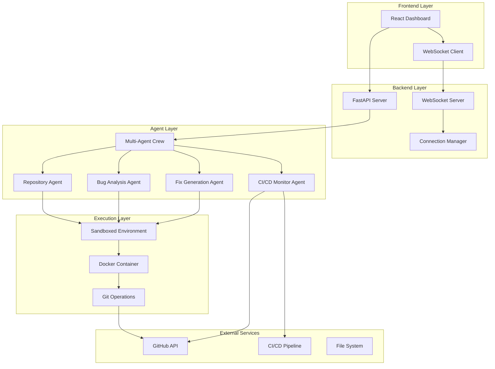

# Design Document

## Overview

The Autonomous CI/CD Healing Agent is a multi-tier system consisting of a React frontend dashboard, FastAPI backend with multi-agent architecture, and integrated CI/CD monitoring capabilities. The system follows a microservices pattern with real-time communication via WebSockets and sandboxed code execution using Docker containers.

The architecture leverages CrewAI for multi-agent orchestration, with specialized agents for repository analysis, bug detection, fix generation, and CI/CD monitoring. The system is designed to be deployed on cloud platforms like Vercel (frontend) and Railway (backend) for the hackathon requirements.

## Architecture

### High-Level Architecture



### Component Architecture

The system is organized into distinct layers with clear separation of concerns:

1. **Presentation Layer**: React dashboard with responsive design and real-time updates
2. **API Layer**: FastAPI with RESTful endpoints and WebSocket support
3. **Business Logic Layer**: Multi-agent system using CrewAI framework
4. **Execution Layer**: Sandboxed Docker environment for safe code execution
5. **Integration Layer**: GitHub API and CI/CD pipeline integration

## Components and Interfaces

### Frontend Components

#### Dashboard Layout Component
- **Purpose**: Main container for all dashboard sections
- **Props**: `runData`, `isLoading`, `error`
- **State Management**: Uses React Context for global state
- **Responsive Design**: CSS Grid layout with mobile-first approach

#### Input Section Component
- **Purpose**: Handles user input for repository URL and team information
- **Props**: `onSubmit`, `isLoading`
- **Validation**: Real-time URL validation and team name sanitization
- **Interface**:
```typescript
interface InputSectionProps {
  onSubmit: (data: RunAgentRequest) => void;
  isLoading: boolean;
}

interface RunAgentRequest {
  repo_url: string;
  team_name: string;
  leader_name: string;
}
```

#### Run Summary Card Component
- **Purpose**: Displays high-level execution results
- **Props**: `runData`, `status`
- **Features**: Status badges, time tracking, branch name display
- **Interface**:
```typescript
interface RunSummaryProps {
  runData: {
    repo_url: string;
    team_name: string;
    leader_name: string;
    branch_name: string;
    total_failures: number;
    total_fixes: number;
    final_status: 'PASSED' | 'FAILED';
    total_time: number;
  };
}
```

#### Score Breakdown Panel Component
- **Purpose**: Visualizes scoring with progress bars and charts
- **Props**: `scoreData`
- **Features**: Animated progress bars, bonus/penalty indicators
- **Libraries**: Chart.js or Recharts for visualization

#### Fixes Applied Table Component
- **Purpose**: Detailed table of all fixes with filtering and sorting
- **Props**: `fixes`, `onSort`, `onFilter`
- **Features**: Color-coded status, expandable rows for details
- **Interface**:
```typescript
interface Fix {
  file: string;
  bug_type: 'LINTING' | 'SYNTAX' | 'LOGIC' | 'TYPE_ERROR' | 'IMPORT' | 'INDENTATION';
  line_number: number;
  commit_message: string;
  status: 'FIXED' | 'FAILED';
}
```

#### CI/CD Timeline Component
- **Purpose**: Visual timeline of pipeline runs
- **Props**: `cicdRuns`, `currentIteration`, `maxIterations`
- **Features**: Interactive timeline, status indicators, timestamps

### Backend Components

#### FastAPI Application
- **Purpose**: Main API server with CORS and middleware configuration
- **Endpoints**: RESTful API for agent operations
- **WebSocket**: Real-time communication with frontend
- **Configuration**: Environment-based settings for deployment flexibility

#### Agent Router
- **Purpose**: HTTP endpoint handlers for agent operations
- **Endpoints**:
  - `POST /api/run-agent`: Initiates agent execution
  - `GET /api/status/{run_id}`: Returns current run status
  - `GET /api/results/{run_id}`: Returns complete results
  - `GET /api/runs`: Lists all runs
- **Background Tasks**: Asynchronous agent execution

#### Connection Manager
- **Purpose**: Manages WebSocket connections for real-time updates
- **Features**: Connection pooling, automatic cleanup, broadcast messaging
- **Interface**:
```python
class ConnectionManager:
    async def connect(self, run_id: str, websocket: WebSocket)
    def disconnect(self, run_id: str)
    async def send_update(self, run_id: str, data: dict)
```

### Multi-Agent System

#### Repository Analysis Agent
- **Purpose**: Clones and analyzes repository structure
- **Tools**: Git operations, file system analysis, language detection
- **Output**: Repository metadata, file structure, test file locations
- **Responsibilities**:
  - Clone repository to sandboxed environment
  - Detect programming language and framework
  - Identify test files and configuration
  - Generate repository analysis report

#### Bug Detection Agent
- **Purpose**: Identifies code issues and categorizes failures
- **Tools**: AST parsing, linting tools, test execution
- **Output**: Categorized bug reports with line numbers and descriptions
- **Responsibilities**:
  - Execute all discovered tests
  - Parse error messages and stack traces
  - Categorize bugs by type (LINTING, SYNTAX, etc.)
  - Generate detailed bug reports

#### Fix Generation Agent
- **Purpose**: Creates targeted fixes for identified issues
- **Tools**: Code analysis, pattern matching, AST manipulation
- **Output**: Code patches with validation
- **Responsibilities**:
  - Analyze bug context and generate appropriate fixes
  - Validate fixes don't break existing functionality
  - Create descriptive commit messages
  - Apply fixes to codebase

#### CI/CD Monitor Agent
- **Purpose**: Monitors pipeline status and manages iterations
- **Tools**: GitHub API, CI/CD platform APIs, status polling
- **Output**: Pipeline status updates, iteration management
- **Responsibilities**:
  - Push commits to properly named branch
  - Monitor CI/CD pipeline execution
  - Track iteration count against retry limit
  - Report final pipeline status

## Data Models

### Run Data Model
```python
class RunData(BaseModel):
    run_id: str
    status: Literal["STARTING", "CLONING", "ANALYZING", "FIXING", "MONITORING", "COMPLETED", "ERROR"]
    repo_url: str
    team_name: str
    leader_name: str
    branch_name: str
    started_at: datetime
    completed_at: Optional[datetime]
    total_time: Optional[int]  # seconds
    fixes: List[Fix]
    cicd_runs: List[CICDRun]
    score: Optional[ScoreBreakdown]
    error: Optional[str]
```

### Fix Data Model
```python
class Fix(BaseModel):
    file: str
    line_number: int
    bug_type: Literal["LINTING", "SYNTAX", "LOGIC", "TYPE_ERROR", "IMPORT", "INDENTATION"]
    description: str
    fix_hint: str
    commit_message: str
    status: Literal["FIXED", "FAILED"]
    original_line: Optional[str]
    fixed_line: Optional[str]
```

### CI/CD Run Data Model
```python
class CICDRun(BaseModel):
    iteration: int
    status: Literal["PASSED", "FAILED", "RUNNING"]
    timestamp: datetime
    duration: Optional[int]  # seconds
    failures_remaining: int
    pipeline_url: Optional[str]
```

### Score Breakdown Model
```python
class ScoreBreakdown(BaseModel):
    base_score: int = 100
    speed_bonus: int = 0  # +10 if < 5 minutes
    efficiency_penalty: int = 0  # -2 per commit over 20
    final_score: int
    total_commits: int
    total_time: int  # seconds
```

## Error Handling

### Frontend Error Handling
- **Network Errors**: Retry logic with exponential backoff
- **WebSocket Disconnection**: Automatic reconnection with status preservation
- **Validation Errors**: Real-time form validation with user-friendly messages
- **API Errors**: Centralized error handling with toast notifications

### Backend Error Handling
- **Repository Access Errors**: Graceful handling of private repos and invalid URLs
- **Git Operations**: Retry logic for network issues, proper cleanup on failures
- **Agent Execution Errors**: Isolation of agent failures, detailed error reporting
- **Resource Management**: Proper cleanup of Docker containers and temporary files

### Agent Error Handling
- **Code Execution Errors**: Sandboxed execution with timeout protection
- **Fix Generation Failures**: Fallback to manual fix suggestions
- **CI/CD Integration Errors**: Retry logic with exponential backoff
- **Iteration Limit Handling**: Graceful termination with partial results

## Testing Strategy

### Frontend Testing
- **Unit Tests**: Jest and React Testing Library for component testing
- **Integration Tests**: End-to-end testing with Cypress or Playwright
- **Visual Regression Tests**: Storybook with Chromatic for UI consistency
- **Accessibility Tests**: axe-core integration for WCAG compliance

### Backend Testing
- **Unit Tests**: pytest for individual function testing
- **Integration Tests**: FastAPI TestClient for endpoint testing
- **Agent Tests**: Mock external services for isolated agent testing
- **Load Tests**: Locust or similar for performance validation

### System Testing
- **End-to-End Tests**: Full workflow testing with real repositories
- **Performance Tests**: Response time and resource usage validation
- **Security Tests**: Input validation and sandboxing verification
- **Deployment Tests**: Automated testing in staging environments

### Test Data Management
- **Mock Repositories**: Curated set of repositories with known issues
- **Test Fixtures**: Standardized test data for consistent results
- **CI/CD Pipeline Tests**: Automated testing of the testing pipeline itself
- **Regression Tests**: Automated testing of previously fixed issues

## Deployment Architecture

### Frontend Deployment (Vercel)
- **Build Process**: Vite build with optimized bundles
- **Environment Variables**: API endpoints, WebSocket URLs
- **CDN Integration**: Global content delivery for performance
- **Custom Domain**: Professional URL for hackathon submission

### Backend Deployment (Railway)
- **Container Deployment**: Docker-based deployment with health checks
- **Environment Configuration**: Secure environment variable management
- **Auto-scaling**: Horizontal scaling based on load
- **Monitoring**: Application performance monitoring and logging

### Security Considerations
- **Sandboxed Execution**: Docker containers with limited privileges
- **Input Validation**: Comprehensive validation of all user inputs
- **Rate Limiting**: API rate limiting to prevent abuse
- **Secret Management**: Secure handling of GitHub tokens and API keys

### Monitoring and Observability
- **Application Logs**: Structured logging with correlation IDs
- **Performance Metrics**: Response times, success rates, resource usage
- **Error Tracking**: Centralized error reporting and alerting
- **Health Checks**: Automated health monitoring for all services